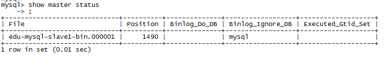
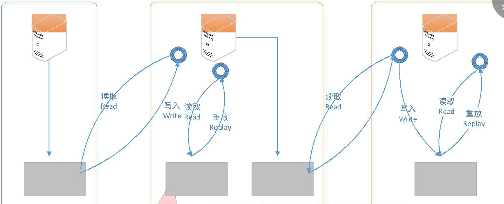
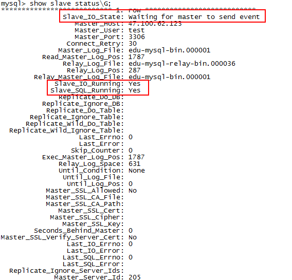

# mysql 主从复制

## 简介

MySQL5.6 开始主从复制有两种方式：基于日志（binlog）、基于 GTID（全局事务标示符）。
本教程主要讲基于日志（binlog）的复制。

- 主从服务器操作系统版本和位数一致；
- Master 和 Slave 数据库的版本要一致；
- Master 和 Slave 数据库中的数据要一致；
- Master 开启二进制日志，Master 和 Slave 的 server_id 在局域网内必须唯一；

## 搭建步骤

**以下配置在数据库安装的基础之上配置的，本教程使用的数据库为Mysql 5.6.35，操作系统为Centos 7.3** Mysql单机搭建步骤 [mysql安装](mysql安装.md)

*假设 Master IP : 192.168.0.1 / Slave IP : 192.168.0.2*

### Master 上的配置

- 修改数据库配置文件，指明 server_id，开启二进制日志(log-bin)

<pre>

##设置 server_id，一般设置为 IP 
server_id=205

##复制过滤：需要备份的数据库，输出 binlog 
#binlog-do-db=roncoo

##复制过滤：不需要备份的数据库，不输出（mysql 库一般不同步） 
binlog-ignore-db=mysql

##开启二进制日志功能，可以随便取，最好有含义
log-bin=edu-mysql-bin

##为每个 session 分配的内存，在事务过程中用来存储二进制日志的缓存
binlog_cache_size=1M

## 主从复制的格式（mixed,statement,row，默认格式是 statement）
binlog_format=mixed

##二进制日志自动删除/过期的天数。默认值为 0，表示不自动删除。 
expire_logs_days=7

##跳过主从复制中遇到的所有错误或指定类型的错误，避免 slave 端复制中断。
##如：1062 错误是指一些主键重复，1032 错误是因为主从数据库数据不一致
slave_skip_errors=1062

</pre>

- 启动/重启 Master 数据库服务，登录数据库，创建数据同步用户，并授予相应的权限
	- 重启: `service mysql restart`
	- 登录mysql服务： ` mysql -uroot -p`
	- 创建数据同步用户，并授予相应的权限： `grant replication slave, replication client on *.* to 'test'@'192.168.0.2' identified by '123456'`
	- 刷新授权表信息： `flush privileges`
	- 查看 position 号： ` show master status`
	
	

- 创建`store`库、表，并写入一定量的数据，用于模拟现有的业务系统数据库

<pre>

## 创建store库
create database if not exists store default charset utf8 collate utf8_general_ci;

use roncoo;

DROP TABLE IF EXISTS `edu_user`;

## 创建edu_user表
CREATE TABLE `edu_user` (

`Id` int(11) NOT NULL AUTO_INCREMENT,

`userName` varchar(255) NOT NULL DEFAULT '' COMMENT '用户名', `pwd` varchar(255) NOT NULL DEFAULT '' COMMENT '密码', PRIMARY KEY (`Id`)

) ENGINE=InnoDB AUTO_INCREMENT=2 DEFAULT CHARSET=utf8 COMMENT='用户信息表'; 

## 插入两条数据
INSERT INTO `edu_user` VALUES (1,'pengc','123456'),(2,'wangw','123456'));
</pre>

- 为了保证数据的一致性，我们需要将以上创建的库、表以及表数据copy一份至Slave库
	- 使用 `mysqldump` 方式
	- 将以上语句直接在Slave库中运行一遍

### Slave 上的配置

- 接下来处理 Slave（192.168.1.206），配置文件只需修改一项，其余配置用命令来操作

<pre>

##设置 server_id，一般设置为 IP 
server_id=206

##复制过滤：需要备份的数据库，输出 binlog 
#binlog-do-db=test

##复制过滤：不需要备份的数据库，不输出（mysql 库一般不同步） 
binlog-ignore-db=mysql

##开启二进制日志，以备 Slave 作为其它 Slave 的 Master 时使用
log-bin=edu-mysql-slave1-bin

##为每个 session 分配的内存，在事务过程中用来存储二进制日志的缓存
binlog_cache_size = 1M

##主从复制的格式（mixed,statement,row，默认格式是 statement） 
binlog_format=mixed

##二进制日志自动删除/过期的天数。默认值为 0，表示不自动删除。 
expire_logs_days=7

##跳过主从复制中遇到的所有错误或指定类型的错误，避免 slave 端复制中断。
##如：1062 错误是指一些主键重复，1032 错误是因为主从数据库数据不一致
slave_skip_errors=1062

## relay_log 配置中继日志
relay_log=edu-mysql-relay-bin

##log_slave_updates 表示 slave 将复制事件写进自己的二进制日志 
log_slave_updates=1

##防止改变数据(除了特殊的线程) 
read_only=1

</pre>

如果 Slave 为其它 Slave 的 Master 时，必须设置 bin_log。在这里，我们开启了二进制日志，
而且显式的命名(默认名称为 hostname，但是，如果 hostname 改变则会出现问题)。
relay_log 配置中继日志，log_slave_updates 表示 slave 将复制事件写进自己的二进制日志。
当设置 log_slave_updates 时，你可以让 slave 扮演其它 slave 的 master。此时，slave 把 SQL线程执行的事件写进行自己的二进制日志(binary log)，然后，它的 slave 可以获取这些事件并执行它。如下图所示（发送复制事件到其它 Slave）：

- 重启mysql服务，登录 Slave 数据库，添加相关参数
	- 重启： `service mysql restart`
	- 登录mysql服务： `mysql -uroot -p`
	- 设置Slave去Master读取日志： `change master to master_host='192.168.0.1', master_user='test', master_password='123456', master_port=3306, master_log_file='edu-mysql-bin.000001', master_log_pos=1490, master_connect_retry=30;`

	<pre>
	master_host='192.168.0.1'	## Master 的 IP 地址
	master_user='test'	## 用于同步数据的用户（在 Master 中授权的用户）
	master_password='123456'	## 同步数据用户的密码
	master_port=3306	## Master 数据库服务的端口
	master_log_file='edu-mysql-bin.000001'	##指定 Slave 从哪个日志文件开始读复制数据（可
	在Master 上使用 show master status 查看到日志文件名）
	master_log_pos=1490	## 从哪个 POSITION 号开始读
	master_connect_retry=30	##当重新建立主从连接时，如果连接建立失败，间隔多久后重试。单位为秒，默认设置为 60 秒，同步延迟调优参数。
	</pre>

- 查看主从同步状态： `show slave status\G`

可看到 Slave_IO_State 为空， Slave_IO_Running 和 Slave_SQL_Running 是 No，表明 Slave 还没有开始复制过程。

- 开启主从同步： `start slave`
- 再次查看主从同步状态： `show slave status\G`

## 测试

- 在 Master 中的 store 库上变更数据的同步测试

INSERT INTO `edu_user` VALUES (4,'同步测试 1','123456'),(5,'同步测试 2','123456');

- 在 Master 上新建一个 store-test 库

create database if not exists store-test default charset utf8 collate utf8_general_ci;

## 配置文件

- [my.cnf_Master](mysql/file/my.cnf_Master)

- [my.cnf_Slave](mysql/file/my.cnf_Slave)

## 参考资料

- [http://www.roncoo.com/article/detail/127207](http://www.roncoo.com/article/detail/127207)